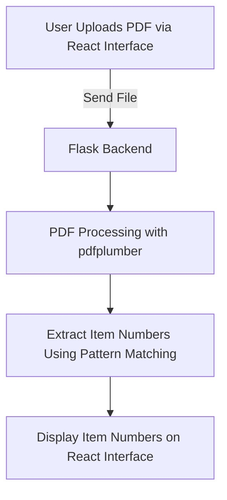

<h1 align="center"><a href="https://github.com/ronknight/ItemNumber-Extractor">🔍 PDF Item Number Extractor and 🛠️ Links Generator</a></h1>
<h4 align="center">🛠️ A Python & React tool for extracting item numbers from PDF files via a Flask and React-powered interface.</h4>

<p align="center">
  <a href="https://twitter.com/PinoyITSolution"></a>
  <a href="https://github.com/ronknight?tab=followers"></a>
  <a href="https://github.com/ronknight/ronknight/stargazers"></a>
  <a href="https://github.com/ronknight/ronknight/network/members"></a>
  <a href="https://youtube.com/@PinoyITSolution"></a>
  <a href="https://github.com/ronknight/ItemNumber-Extractor/issues"></a>
  <a href="https://github.com/ronknight/ItemNumber-Extractor/blob/master/LICENSE"></a>
  <a href="#"></a>
  <a href="https://github.com/ronknight"></a>
</p>

<p align="center">
  <a href="#project-overview">Project Overview</a> •
  <a href="#files">Files</a> •
  <a href="#installation">Installation</a> •
  <a href="#usage">Usage</a> •
  <a href="#visualization">Visualization</a> •
  <a href="#disclaimer">Disclaimer</a>
</p>

## Project Overview
The **ItemNumber-Extractor** is a web application that provides a React-based interface for users to upload PDF files. The backend, powered by Flask, processes the PDF to extract item numbers based on a predefined pattern. This tool helps automate data extraction from PDF documents and saves extracted item numbers for further analysis or processing.

## Files
- **pdf-backend-python/app.py**: Flask application script that handles PDF upload, item number extraction, and response to frontend requests.
- **pdf-frontend**: Contains all files related to the React frontend, which provides an interface for PDF upload and displays extracted item numbers.
- **.devcontainer**: Configuration for GitHub Codespaces with setup for dependencies and auto-start commands for both servers.
- **Dockerfile**: Defines the container environment, ensuring dependencies are pre-installed in Codespaces.
- **README.md**: Project documentation and setup guide.
- **requirements.txt**: Lists Python dependencies required for the Flask backend.
- **LICENSE**: License file for open-source distribution.

## Installation
To set up the ItemNumber-Extractor, follow these steps.

### Cloning the Repository
Clone the repository:
```bash
git clone https://github.com/ronknight/ItemNumber-Extractor.git
cd ItemNumber-Extractor
```

### GitHub Codespaces Setup
This project is configured to run in **GitHub Codespaces**. Codespaces automatically installs dependencies and starts the Flask and React servers. Ensure both servers' ports (5000 for Flask and 3000 for React) are set to public:

1. **Port 5000 and 3000 Visibility**:
   Go to the Codespaces settings panel, locate ports 5000 and 3000, and set both to **public**.

2. **Port Management Reminder**:
   Before starting the servers, kill any lingering processes on the ports to avoid conflicts:
   ```bash
   lsof -ti :5000 -ti :3000 | xargs kill -9
   ```

### Manual Setup (Optional)
If you're running this project locally, ensure both Python and Node.js are installed.

1. **Python and Flask Backend**:
   ```bash
   cd pdf-backend-python
   pip3 install -r requirements.txt
   ```

2. **React Frontend**:
   ```bash
   cd pdf-frontend
   npm install
   ```

## Usage

### Running the Flask and React Servers

In Codespaces, the servers should start automatically. If you’re running locally, start each server as follows:

1. **Start Flask Server (Python)**
   Make sure port 5000 is free before starting Flask:
   ```bash
   cd pdf-backend-python
   python3 app.py
   ```

2. **Start React Server (Node.js)**
   In a new terminal, start the React frontend:
   ```bash
   cd pdf-frontend
   npm start
   ```

### Accessing the Application

Once both servers are running:

- **Flask Backend**: Accessed at `http://localhost:5000`
- **React Frontend**: Accessed at `http://localhost:3000`

### Uploading a PDF for Extraction

1. Open the React frontend in your browser.
2. Use the interface to upload a PDF file.
3. The Flask backend processes the file, extracts item numbers, and sends the results back to the React frontend for display.

## 📊 Visualization
Here's a simple flow of how the ItemNumber-Extractor processes files:



## ⚠️ Disclaimer
This project processes document data that may contain sensitive information. Ensure compliance with relevant privacy laws and handle extracted data responsibly.